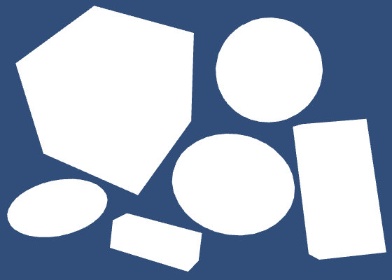
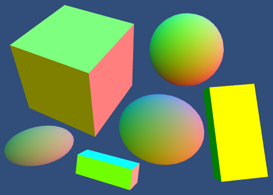
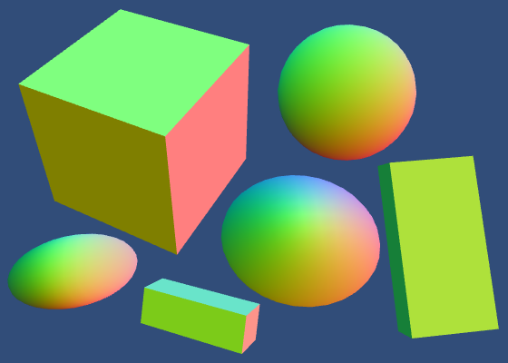
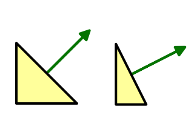
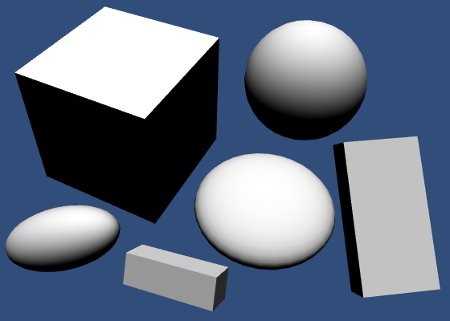

>  将法线从对象转换为世界空间
>
>  使用方向灯
>
> 计算漫反射和镜面反射
>
> 执行能量守恒
>
> 使用metallic工作流
>
> 利用Unity的PBS算法

这是渲染教程系列的第四部分。前面的部分是关于合并纹理。这次我们将学习如何计算照明。

本教程是使用Unity 5.4.0b17。


# 法线

我们能看见东西，因为我们的眼睛能探测到电磁辐射。单个的光量子被称为光子。我们可以看到电磁波谱的一部分，我们称之为可见光。其余的光谱对我们来说是不可见的。

光源发出光。有些光会照射到物体上，有些光被物体反射。如果光线最终打到我们的眼睛或相机镜头上，我们就能看到物体。

为了解决这个问题，我们必须知道物体的表面。我们知道它的位置，但还不知道它方向。为此，我们需要曲面法向量。

## 使用网格法线

复制我们的第一个着色器，并命名为My First Lighting Shader。用这个着色器创建一个材质，并把它分配给场景中的一些立方体和球体。给物体不同的旋转和缩放，得到下面的场景。

```c
Shader "Custom/My First Lighting Shader" {
	…
}
```



Unity的立方体和球体网格包含顶点法线。我们可以通过语义（[semantic](https://docs.unity3d.com/Manual/SL-ShaderSemantics.html)）获取它们并直接将它们传递到片段着色器。

```c
            struct VertexData {
				float4 position : POSITION;
				float3 normal : NORMAL;
				float2 uv : TEXCOORD0;
			};
			
			struct Interpolators {
				float4 position : SV_POSITION;
				float2 uv : TEXCOORD0;
				float3 normal : TEXCOORD1;
			};

			Interpolators MyVertexProgram (VertexData v) {
				Interpolators i;
				i.uv = TRANSFORM_TEX(v.uv, _MainTex);
				i.position = mul(UNITY_MATRIX_MVP, v.position);
				i.normal = v.normal;
				return i;
			}
```

现在我们可以在着色器中可视化法线。

```c
float4 MyFragmentProgram (Interpolators i) : SV_TARGET {
				return float4(i.normal * 0.5 + 0.5, 1);
			}
```


这些是原始法线，直接来自网格。立方体的面看起来是平面的，因为每个面都是一个独立的四边形，有四个顶点。这些顶点的法线都指向同一个方向。相反，球体的顶点法线都指向不同的方向，从而实现了平滑插值。

## 动态批处理

立方体的法线有些奇怪。我们希望每个立方体都显示相同的颜色，但事实并非如此。更奇怪的是，立方体可以改变颜色，这取决于我们如何观察它们。

<iframe  height=500 width=500 frameborder="0" allowfullscreen src="https://gfycat.com/@catlikecoding"></iframe>
这是由动态批处理造成的。Unity动态地将小网格合并在一起，以减少drawcalls。球体的网格太大了，所以不会受到影响。但立方体是平的。

为了合并网格，它们必须从局部空间转换为世界空间。对象是否成批处理以及如何成批处理，取决于如何对它们进行排序以进行渲染。由于这种转换也影响法线，这就是为什么我们看到颜色的变化。

如果你想，你可以通过player setting中关闭动态批处理。


除了动态批处理外，Unity还可以进行静态批处理。这与静态几何不同，但也涉及到对世界空间的转换，它发生在构建时。


虽然你需要注意动态批处理，但是没有什么需要担心的。实际上，我们对法线也要做同样的处理。所以你可以让这个设置启用着。

## 世界空间的法线

除了动态批处理的对象外，所有的法线都在对象空间中。但是我们必须知道世界空间的表面朝向。所以我们要把法线从物体变换到世界空间。我们需要对象的变换矩阵。

Unity将一个对象的整个转换层次结构分解成一个单独的转换矩阵，就像我们在第1部分中所做的那样。我们可以写成，其中T是单独的变换，O是组合变换。这个矩阵称为对象空间到世界空间的变换矩阵。

Unity通过一个float4×4类型的变量 unity_ObjectToWorld使矩阵在着色器中可用，该变量在UnityShaderVariables中定义。将这个矩阵与顶点着色器中的法线相乘，将其转换为世界空间。因为它是一个方向，所以应该忽略重新定位。所以第四个齐次坐标一定是零。

```c
Interpolators MyVertexProgram (VertexData v) {
				Interpolators i;
				i.position = mul(UNITY_MATRIX_MVP, v.position);
				i.normal = mul(unity_ObjectToWorld, float4(v.normal, 0));
				i.uv = TRANSFORM_TEX(v.uv, _MainTex);
				return i;
			}
```

或者，我们可以只乘以矩阵的3×3部分。编译后的代码最终是相同的，因为编译器将消除所有与常数0相乘的内容。

```c
i.normal = mul((float3x3)unity_ObjectToWorld, v.normal);
```



法线现在在世界空间中，但有些看起来比其他的更亮。那是因为它们也被缩放了。所以我们必须在变换后将它归一化。

```c
i.normal = mul(unity_ObjectToWorld, float4(v.normal, 0));
i.normal = normalize(i.normal);
```



当我们再次归一化向量时，它们对于没有统一缩放的物体来说看起来很奇怪。这是因为当一个表面在一个维度中拉伸时，它的法线不会以同样的方式拉伸。


当缩放不均匀时，应将其反转过来作为法线。这样，法线就会与变形后的曲面形状相匹配。对于统一的缩放没有区别。



所以我们要反转缩放，但是旋转应该保持不变。我们该怎么做呢？

我们将对象的转换矩阵描述为，但是我们可以更具体地描述它。我们知道层次结构中的每一步都结合了缩放、旋转和定位。所以每个T都可以分解成SRP。

这意味着，但是为了简短起见，我们只写。

因为法线是方向向量，我们不关心重定位。我们可以把它进一步缩短为，我们只需要考虑3×3矩阵。

我们想要反转缩放，但要保持旋转不变。我们需要一个新的矩阵。

除了对象-世界矩阵，Unity还提供了对象的世界-对象矩阵。这些矩阵确实是彼此的逆矩阵。所以我们也可以得到。

这给了我们需要的反转缩放，但也给了我们反转旋转和反转变换的顺序。幸运的是，我们可以通过转置矩阵来消除那些不需要的影响。我们得到。

我们来转置这个世界到对象的矩阵然后把它和顶点法线相乘。

```c
i.normal = mul(
					transpose((float3x3)unity_WorldToObject),
					v.normal
				);
				i.normal = normalize(i.normal);
```


实际上，UnityCG包含一个方便的UnityObjectToWorldNormal函数，它就是为这个做的。我们可以用这个函数。它也使用显式乘法，而不是使用transpose。这应该会产生更好的编译代码。

```c
Interpolators MyVertexProgram (VertexData v) {
				Interpolators i;
				i.position = mul(UNITY_MATRIX_MVP, v.position);
				i.normal = UnityObjectToWorldNormal(v.normal);
				i.uv = TRANSFORM_TEX(v.uv, _MainTex);
				return i;
			}
```

## 重新归一化

在顶点程序中生成正确的法线后，它们将通过插值器传递。不幸的是，在不同的单位长度向量之间进行线性插值不会得到另一个单位长度向量。它会变短。

所以我们必须在片段着色器中再次标准化法线。

```c
float4 MyFragmentProgram (Interpolators i) : SV_TARGET {
				i.normal = normalize(i.normal);
				return float4(i.normal * 0.5 + 0.5, 1);
			}
```


虽然这产生了更好的结果，但差别通常很小。如果你更看重性能，你可以决定不在片段着色器中重新归一化。这是移动设备的常见优化。


# 漫反射着色器

我们看到的物体本身不是光源，因为它们反射光线。这种反射可以以不同的方式发生。我们先来考虑漫反射。

漫反射的发生是因为光线不只是从表面反弹。相反，它会穿透表面，反弹一段时间，分裂几次，直到再次离开表面。在现实中，光子和原子之间的相互作用要比这复杂得多，但我们不需要知道真实世界物理的很多细节。

从一个表面漫反射出多少光取决于光线射向它的角度。当表面以0°的角度被正面撞击时，大多数光会被反射。随着角度的增加，反射会减少。在90°时，没有光照射到表面，所以它保持黑暗。漫反射光的量与光的方向与表面法线之间夹角的余弦值成正比。这就是朗伯（Lambert）余弦定律。


我们可以通过计算表面法线和光的方向的点积来确定这个朗伯氏反射率因子。我们已经知道了法线，但还不知道光的方向。让我们从一个固定的光的方向开始，直接从上面来。

```c
float4 MyFragmentProgram (Interpolators i) : SV_TARGET {
				i.normal = normalize(i.normal);
				return dot(float3(0, 1, 0), i.normal);
			}
```




##  限制照明

当表面朝向光时，计算点积是有效的，但当表面背向光时，计算点积则无效。在这种情况下，从逻辑上讲，表面将处于自己的阴影中，它应该完全不接受光线。由于光的方向与法线之间的夹角在这一点上必须大于90°，因此其余弦值和点积为负。因为我们不想要负面的光，所以我们必须必须控制结果。我们可以用标准的max函数。

```c
return max(0, dot(float3(0, 1, 0), i.normal));
```

你会经常看到着色器使用saturate函数代替max。这个标准函数把输入夹在0和1之间。

```c
return saturate(dot(float3(0, 1, 0), i.normal));
```

这似乎是不必要的，因为我们知道点积不会产生大于1的结果。然而，在某些情况下，根据硬件的不同，它实际上可能更有效率。但是在这一点上，我们不应该担心这样的微优化。事实上，我们把这个任务交给Unity的人。

UnityStandardBRDF包含文件定义了方便的DotClamped函数。这个函数执行点积并确保它不为负值。这正是我们所需要的。它还包含许多其他的照明功能，并包含其他有用的文件，我们将在以后需要到，所以让我们先来尝试用一下。

```c
#include "UnityCG.cginc"
			#include "UnityStandardBRDF.cginc"

			…

			float4 MyFragmentProgram (Interpolators i) : SV_TARGET {
				i.normal = normalize(i.normal);
				return DotClamped(float3(0, 1, 0), i.normal);
			}
```

 因为UnityStandardBRDF已经包含了UnityCG和其他一些文件，我们不需要显式地包含它。这样做并不会错，但是我们尽量保持代码的简洁。

```c
//			#include "UnityCG.cginc"
			#include "UnityStandardBRDF.cginc"
```


## 光源

 我们应该使用场景中的光的方向，而不是硬编码的光的风向。默认情况下，每个Unity场景都有一个代表太阳的灯光。它是一个定向光，这意味着它被认为是无限远。因此，所有的光线都来自一个方向。当然这在现实生活中不是真的，但是太阳离我们太远了，所以这是一个合理的近似值。


UnityShaderVaribles定义了float4 的_WorldSpaceLightPos0，在定向光的情况，它包含当前灯光的位置，或者光线的方向。它有四个分量，因为它们是齐次坐标。所以方向光的第四个分量是0。

```c
float3 lightDir = _WorldSpaceLightPos0.xyz;
return DotClamped(lightDir, i.normal);
```

## 灯光模式

在产生正确的结果之前，我们必须告诉Unity我们想要使用哪些光数据。我们通过在着色器Pass中添加一个LightMode标签来做到这一点。

我们需要哪种灯光模式取决于我们如何渲染场景。我们可以使用forward或deferred渲染路径。也有两种较老的渲染模式，但我们不会用它们。通过Player渲染设置渲染路径。它位于颜色空间选项的正上方。我们使用Forward渲染，这是默认的。


我们必须使用ForwardBase pass。这是通过forward渲染路径时使用的第一个pass。它为我们提供了进入场景的主要方向光。它还设置了一些其他的东西，我们会在稍后会讲到它们。

```c
Pass {
			Tags {
				"LightMode" = "ForwardBase"
			}

			CGPROGRAM

			…

			ENDCG
		}
```

 <iframe height=300 width="300" src="https://gfycat.com/@catlikecoding"></iframe>
## 灯光颜色

当然，光并不总是白的。每个光源都有自己的颜色，我们可以通过定义在UnityLightingCommon中的fixed4 _LightColor0变量得到它。

这个变量包含光的颜色，乘以光的强度。虽然它提供了所有四个通道，但我们只需要RGB分量。

```c
float4 MyFragmentProgram (Interpolators i) : SV_TARGET {
				i.normal = normalize(i.normal);
				float3 lightDir = _WorldSpaceLightPos0.xyz;
				float3 lightColor = _LightColor0.rgb;
				float3 diffuse = lightColor * DotClamped(lightDir, i.normal);
				return float4(diffuse, 1);
			}
```


## 反照率

大多数材质吸收部分电磁波谱。这赋予了它们颜色。例如，如果所有可见的红色频率光都被吸收，然后将会显示青色。

材质的漫反射的颜色被称为反照率。反照率在拉丁语中是是白色的意思。它描述了红、绿、蓝三色通道的漫反射。其余的被吸收。我们可以使用材质的纹理和颜色去定义它。

```c
float4 MyFragmentProgram (Interpolators i) : SV_TARGET {
				i.normal = normalize(i.normal);
				float3 lightDir = _WorldSpaceLightPos0.xyz;
				float3 lightColor = _LightColor0.rgb;
				float3 albedo = tex2D(_MainTex, i.uv).rgb * _Tint.rgb;
				float3 diffuse =
					albedo * lightColor * DotClamped(lightDir, i.normal);
				return float4(diffuse, 1);
			}
```

让我们在检视面板中也改变主要纹理的Albedo标签。

```c
Properties {
		_Tint ("Tint", Color) = (1, 1, 1, 1)
		_MainTex ("Albedo", 2D) = "white" {}
	}
```


#  高光着色

除了漫反射外，还有镜面反射。这种情况发生在光线到达表面后没有扩散的情况。相反，光线从表面反弹回来的角度等于它击中表面的角度。这就是你在镜子里看到的反射的原因。

与漫反射不同，观察者的位置对镜面反射很重要。只有直接向你反射的光是可见的。其余的去了别的地方，所以你不会看到它。

所以我们需要知道从表面到观察者的方向。这需要曲面和摄像机的世界空间位置。

我们可以在顶点程序中确定曲面的世界空间位置，通过对象到世界的矩阵，然后将其传递给片段程序。

```c
	struct Interpolators {
				float4 position : SV_POSITION;
				float2 uv : TEXCOORD0;
				float3 normal : TEXCOORD1;
				float3 worldPos : TEXCOORD2;
			};

			Interpolators MyVertexProgram (VertexData v) {
				Interpolators i;
				i.position = mul(UNITY_MATRIX_MVP, v.position);
				i.worldPos = mul(unity_ObjectToWorld, v.position);
				i.normal = UnityObjectToWorldNormal(v.normal);
				i.uv = TRANSFORM_TEX(v.uv, _MainTex);
				return i;
			}
```

摄像头的位置可以通过float3类型的  _WorldSpaceCameraPos来访问，它是在UnityShaderVariables中定义的。我们得到视图方向等于摄像头位置减去表面的世界坐标位置，然后归一化它。

```c
float4 MyFragmentProgram (Interpolators i) : SV_TARGET {
				i.normal = normalize(i.normal);
				float3 lightDir = _WorldSpaceLightPos0.xyz;
				float3 viewDir = normalize(_WorldSpaceCameraPos - i.worldPos);
				
				float3 lightColor = _LightColor0.rgb;
				float3 albedo = tex2D(_MainTex, i.uv).rgb * _Tint.rgb;
				float3 diffuse =
					albedo * lightColor * DotClamped(lightDir, i.normal);
				return float4(diffuse, 1);
			}
```

## 反射灯光

为了知道反射光的去向，我们可以使用标准的reflect函数。它根据入射光线的方向，根据表面法线进行反射。所以我们要反转光的方向。

```c
float3 reflectionDir = reflect(-lightDir, i.normal);
return float4(reflectionDir * 0.5 + 0.5, 1);
```


对于完全光滑的镜子，我们只能看到表面角度刚好的反射光。在所有其他地方，反射光错过了我们，并且曲面对我们来说是黑色的。但是物体并不是完全光滑的。它们有很多微小的突起，这意味着表面的法线会有很大的变化。

我们可以看到一些反射，即使我们的视图方向和反射方向不完全匹配。我们越偏离反射方向，我们看到的就越少。同样，我们可以用DotClamped来算出有多少光到达我们这里。

```c
return DotClamped(viewDir, reflectionDir);
```


## 光滑度

这种效果产生的高光的大小取决于材质的粗糙度。光滑的材质对光的聚焦更好，所以它们有更小的亮点。我们可以通过使它成为一种材质属性来控制这种平滑度。它通常被定义为0到1之间的值，所以我们让它成为一个滑动条。

```c
	Properties {
		_Tint ("Tint", Color) = (1, 1, 1, 1)
		_MainTex ("Texture", 2D) = "white" {}
		_Smoothness ("Smoothness", Range(0, 1)) = 0.5
	}
		
		…

			float _Smoothness;
```

我们通过提高点积的系数来缩小高光。我们使用平滑度，但它必须比1大得多才能达到预期的效果。我们把它乘以100。

```c
return pow(
					DotClamped(viewDir, reflectionDir),
					_Smoothness * 100
				);
```


## Blin-Phong

我们目前正在根据Blinn反射模型计算反射。但最常用的模型是Blinn-Phong。它使用了一个介于光的方向和视图方向之间的矢量。法向量和 half vector 之间的点积决定了镜面的贡献程度。

```c
//				float3 reflectionDir = reflect(-lightDir, i.normal);
				float3 halfVector = normalize(lightDir + viewDir);

				return pow(
					DotClamped(halfVector, i.normal),
					_Smoothness * 100
				);
```


这种方法产生更大的高光，但是可以通过使用更高的平滑度来抵消。虽然这两种方法仍然是近似的，但结果在视觉上比Phong更符合实际。一个很大的限制是，它可以为从后面点亮的对象产生无效的高光。


当使用低平滑度时，这些伪影会变得很明显。它们可以使用阴影隐藏掉，或者根据光线角度淡出高光。Unity 的传统着色器也有这个问题，所以我们也不用担心。不管怎样，我们很快就会转向另一种照明方法。

## 高光颜色

当然，镜面反射的颜色与光源的颜色相匹配。我们把它相乘了。

```c
float3 halfVector = normalize(lightDir + viewDir);
				float3 specular = lightColor * pow(
					DotClamped(halfVector, i.normal),
					_Smoothness * 100
				);

				return float4(specular, 1);
```

但这还不是全部。反射的颜色也取决于材质。这个反照率不一样。金属的反照率往往很低，而反射率却很强，常常是有色的。相比之下，非金属往往有明显的反照率，而它们的镜面反射率较弱，没有着色。

我们可以添加纹理和颜色来定义高光颜色，就像我们为反照率所做的那样。但我们不用另一种纹理了，只要用一种颜色就可以了。

```c
Properties {
		_Tint ("Tint", Color) = (1, 1, 1, 1)
		_MainTex ("Albedo", 2D) = "white" {}
		_SpecularTint ("Specular", Color) = (0.5, 0.5, 0.5)
		_Smoothness ("Smoothness", Range(0, 1)) = 0.1
	}

	…

			float4 _SpecularTint;
			float _Smoothness;

			…

			float4 MyFragmentProgram (Interpolators i) : SV_TARGET {
				…

				float3 halfVector = normalize(lightDir + viewDir);
				float3 specular = _SpecularTint.rgb * lightColor * pow(
					DotClamped(halfVector, i.normal),
					_Smoothness * 100
				);

				return float4(specular, 1);
			}
```

我们可以通过颜色属性来控制镜面反射的颜色和强度。


## 漫反射和高光

漫反射和镜面反射是照明难题的两个部分。我们可以把它们加在一起，使我们的图更完整。

```c
return float4(diffuse + specular, 1);
```


# 能量守恒

只是把漫反射和镜面反射加在一起就有问题了。结果可以比光源更亮。这是非常明显的，当使用一个完全白色镜面结合低平滑度的时候。


当光照射到表面时，部分表面会反射成镜面光。其余部分穿透表面，要么以漫反射光的形式返回，要么被吸收。但我们目前没有考虑到这一点。相反，我们的光以最大的强度反射和漫反射。所以我们最终使光的能量加倍。

我们必须确保漫反射和高光部分的总和永远不超过1。这保证了我们不会凭空创造光。如果总数小于1也可以。这意味着一部分光被吸收了。

由于我们使用一个固定的高光颜色，我们可以简单地通过乘以1减去高光来调整反照率。但这是不方便手动的，特别是如果我们想要使用特定的反照率颜色。让我们在着色器中实现这个。

```c
float3 albedo = tex2D(_MainTex, i.uv).rgb * _Tint.rgb;
albedo *= 1 - _SpecularTint.rgb;
```


漫反射和高光的贡献现在被连在一起了。高光越强，漫反射越弱。一个黑色的高光会产生零反射，在这种情况下，你会看到完全强度的反照率。白光形成完美的镜面，所以反照率会完全消失。

<iframe src="https://thumbs.gfycat.com/QuarterlyAppropriateBarebirdbat-mobile.mp4"></iframe>
## 单色的（Monochrome）

这种方法在高光为灰度时工作得很好。但是当使用其他颜色时，它会产生奇怪的结果。例如，一个红色的高光色只会减少漫反射部分的红色成分。因此，反照率将被染成青色。


为了防止这种颜色，我们可以使用单色能量守恒。这仅仅意味着我们使用了高光颜色中最强的部分来减少反照率。

```c
albedo *= 1 -
					max(_SpecularTint.r, max(_SpecularTint.g, _SpecularTint.b));
```


## 实用函数

正如你所期望的，Unity有一个实用函数来实现能量守恒。这是在UnityStandardUtils中的`EnergyConservationBetweenDiffuseAndSpecular`

```c
#include "UnityStandardBRDF.cginc"
#include "UnityStandardUtils.cginc"
```


这个函数把反照率和高光颜色作为输入，输出一个调整后的反照率。但它还有第三个输出参数，称为“负一反射率”。就是1减去镜面强度，我们乘以反照率的因子。这是一个额外的输出，因为反射率同时需要的其他照明计算。

```c
float3 albedo = tex2D(_MainTex, i.uv).rgb * _Tint.rgb;
//				albedo *= 1 -
//					max(_SpecularTint.r, max(_SpecularTint.g, _SpecularTint.b));

				float oneMinusReflectivity;
				albedo = EnergyConservationBetweenDiffuseAndSpecular(
					albedo, _SpecularTint.rgb, oneMinusReflectivity
				);
```

## Metallic工作流

我们主要关注有两种材质。金属和非金属。后者也被称为介电材质。目前，我们可以用高光来制造金属。同时，我们也可以通过使用弱的单色高光来创建材质，这是Specular工作流。

如果我们能在金属和非金属之间切换就简单多了。由于金属没有反照率，我们可以用这些颜色数据来代替它们的镜面颜色。非金属也没有有色的高光，所以我们根本不需要单独的高光。这就是所谓的Metallic工作流。让我们来尝试一下！

```c
Properties {
		_Tint ("Tint", Color) = (1, 1, 1, 1)
		_MainTex ("Albedo", 2D) = "white" {}
//		_SpecularTint ("Specular", Color) = (0.5, 0.5, 0.5)
		_Metallic ("Metallic", Range(0, 1)) = 0
		_Smoothness ("Smoothness", Range(0, 1)) = 0.1
	}

	…

//			float4 _SpecularTint;
			float _Metallic;
			float _Smoothness;
```


现在我们可以从反照率和金属属性中得到镜面色彩。反照率可以简单地乘以1减去金属值。

```c
float3 specularTint = albedo * _Metallic;
				float oneMinusReflectivity = 1 - _Metallic;
//				albedo = EnergyConservationBetweenDiffuseAndSpecular(
//					albedo, _SpecularTint.rgb, oneMinusReflectivity
//				);
				albedo *= oneMinusReflectivity;
				
				float3 diffuse =
					albedo * lightColor * DotClamped(lightDir, i.normal);

				float3 halfVector = normalize(lightDir + viewDir);
				float3 specular = specularTint * lightColor * pow(
					DotClamped(halfVector, i.normal),
					_Smoothness * 100
				);
```

然而，这是一种过度的简化。即使是纯电介质也有一些镜面反射。因此，高光强度和反射值并不完全匹配金属滑动条的值。这也受到颜色空间的影响。幸运的是，UnityStandardUtils还具有`DiffuseAndSpecularFromMetallic`函数，可以为我们解决这个问题。

```c
float3 specularTint; // = albedo * _Metallic;
				float oneMinusReflectivity; // = 1 - _Metallic;
//				albedo *= oneMinusReflectivity;
				albedo = DiffuseAndSpecularFromMetallic(
					albedo, _Metallic, specularTint, oneMinusReflectivity
				);
```

<iframe src="https://thumbs.gfycat.com/JadedHighJabiru-mobile.mp4"></iframe>
一个细节是，金属滑块本身应该是在Gamma空间中。但是在线性空间渲染时，单个值不会被Unity自动进行Gamma校正。我们可以使用Gamma属性来告诉Unity，它也应该对我们的金属滑块值应用Gamma校正。

```c
[Gamma] _Metallic ("Metallic", Range(0, 1)) = 0
```

不幸的是，现在镜面高光反射对于非金属来说已经变得相当模糊了。为了改善这一点，我们需要一个更好的方法来计算照明。

# 基于物理的着色

长久以来，Blinn-Phong一直是游戏产业的主要应用模型，但现在基于物理的着色——即众所周知的PBS——风靡一时。这是有原因的，因为它更现实，更可预测。理想情况下，游戏引擎和建模工具都是用相同的着色算法。这使得内容创作更加容易。业界正在慢慢地向标准的PBS实现靠拢。

Unity的标准着色器也使用PBS方法。Unity实际上有多个实现。它根据目标平台、硬件和API级别决定使用哪个。该算法可以通过UNITY_BRDF_PBS宏访问，该宏在UnityPBSLighting中定义。BRDF为双向反射分布函数。

```c
//			#include "UnityStandardBRDF.cginc"
//			#include "UnityStandardUtils.cginc"
			#include "UnityPBSLighting.cginc"
```


这些函数需要大量的数学运算，所以我就不详细讲了。它们仍然计算漫反射和镜面反射，只是方式不同于Blinn-Phong。除此之外，还有一个菲涅尔反射分量。这增加了你以掠射角度观察物体时的反射。一旦我们考虑了环境的影响，这些就会变得显而易见。

为了确保Unity选择了最好的BRDF函数，我们必须至少以Shader model 3为目标。我们使用pragma语句来做这件事。

```c
	CGPROGRAM

			#pragma target 3.0

			#pragma vertex MyVertexProgram
			#pragma fragment MyFragmentProgram
```

Unity的BRDF函数返回RGBA颜色，alpha分量总是设置为1。因此我们可以直接让fragment程序返回它的结果。

```c
//				float3 diffuse =
//					albedo * lightColor * DotClamped(lightDir, i.normal);

//				float3 halfVector = normalize(lightDir + viewDir);
//				float3 specular = specularTint * lightColor * pow(
//					DotClamped(halfVector, i.normal),
//					_Smoothness * 100
//				);

				return UNITY_BRDF_PBS();
```

当然，我们必须用参数来调用它。每个函数都有8个参数。前两个是漫反射和镜面颜色。我们已经有了这些。

```c
return UNITY_BRDF_PBS(
					albedo, specularTint
				);
```

接下来的两个参数是反射率和粗糙度。这些参数必须是一减的形式，这是一种优化。我们已经从 
`DiffuseAndSpecularFromMetallic` 中获得  `oneMinusReflectivity`  。平滑度是粗糙度的反义词，所以我们可以直接用它。

```c
return UNITY_BRDF_PBS(
					albedo, specularTint,
					oneMinusReflectivity, _Smoothness
				);
```

当然，表面法线和观察方向也是必要的。这会是第五个和第六个参数。

```c
return UNITY_BRDF_PBS(
					albedo, specularTint,
					oneMinusReflectivity, _Smoothness,
					i.normal, viewDir
				);
```

最后两个参数必须是直接的和间接的光。

## 光的结构

*UnityLightingCommon*定义了一个简单的`UnityLight`结构，Unity着色器使用它来传递光数据。它包含光的颜色、方向和和一个`ndotl`值(漫反射术语)。请记住，这些结构纯粹是为了我们的方便。它不会影响编译后的代码

我们有所有这些信息，所以我们所要做的就是把它放在一个光结构中，并把它作为第七个参数传递。

```c
UnityLight light;
				light.color = lightColor;
				light.dir = lightDir;
				light.ndotl = DotClamped(i.normal, lightDir);
				
				return UNITY_BRDF_PBS(
					albedo, specularTint,
					oneMinusReflectivity, _Smoothness,
					i.normal, viewDir,
					light
				);
```

最后一个参数是间接光。我们必须使用`UnityIndirect`结构，这也是*UnityLightingCommon*所定义的。它包含两种颜色，一种是漫反射，一种是镜面反射。漫反射颜色代表环境光，而高光颜色代表环境反射。

稍后我们将介绍间接光，所以现在只需将这些颜色设置为黑色。

```c
	float4 MyFragmentProgram (Interpolators i) : SV_TARGET {
				i.normal = normalize(i.normal);
				float3 lightDir = _WorldSpaceLightPos0.xyz;
				float3 viewDir = normalize(_WorldSpaceCameraPos - i.worldPos);

				float3 lightColor = _LightColor0.rgb;
				float3 albedo = tex2D(_MainTex, i.uv).rgb * _Tint.rgb;

				float3 specularTint;
				float oneMinusReflectivity;
				albedo = DiffuseAndSpecularFromMetallic(
					albedo, _Metallic, specularTint, oneMinusReflectivity
				);
				
				UnityLight light;
				light.color = lightColor;
				light.dir = lightDir;
				light.ndotl = DotClamped(i.normal, lightDir);
				UnityIndirect indirectLight;
				indirectLight.diffuse = 0;
				indirectLight.specular = 0;

				return UNITY_BRDF_PBS(
					albedo, specularTint,
					oneMinusReflectivity, _Smoothness,
					i.normal, viewDir,
					light, indirectLight
				);
			}
```


下一个教程是[多灯光照明](https://catlikecoding.com/unity/tutorials/rendering/part-5/) 。