> 扰动法线模拟凹凸
>
> 从高度场计算法线
>
> 采样和混合法线
>
> 从切线空间转换为世界空间

这是渲染教程系列的第6部分。前一部分增加了对更复杂的照明的支持。这一次，我们将创建更复杂表面的错觉。

本教程是用Unity 5.4.0f3制作的。


# 凹凸映射

我们可以使用反照率纹理来创建具有复杂颜色图案的材质。我们可以用法线来调整表面的曲率。有了这些工具，我们可以制造出各种各样的表面。然而，一个三角形的表面总是光滑的。它只能在三个法向量之间插值。所以它不能代表粗糙或多变的表面。当放弃反照率纹理而只使用一种纯色时，这一点就很明显了。

体现平滑度的一个很好的例子是一个简单的四边形。添加一个到场景中，通过沿着x轴旋转90°，并使它指向上方。


因为默认的天空盒非常亮，很难看到其他灯光的作用。在本教程中，我们将其关闭。你可以通过在照明设置中将环境强度降低到零来做到这一点。然后只开启主方向灯。在场景视图中找到一个好的视角，这样你就可以在四边形上看到一些光线的差异。


我们怎样才能使这个四边形看起来不平坦呢？我们可以通过在反照率纹理中加入烘焙阴影来模拟粗糙度。然而，这将是完全静态的。如果灯光改变了，或者物体移动了，阴影也应该改变。否则，假象就会破灭。在镜面反射的情况下，甚至相机都不允许移动。

我们可以改变法线来创建曲面的错觉。但是每四个顶点只有四个法线。这只能产生平滑的过渡。如果我们想要一个多变而粗糙的表面，我们需要更多的法线。

我们可以把四边形分成更小的四边形。这给了我们更多的法线。事实上，一旦我们有更多的顶点，我们也可以移动它们。那么我们就不需要表面粗糙的假象了，我们可以做出一个真正粗糙的表面！但是子四边形仍然有同样的问题。我们还要再细分吗？这将导致大量的网格与大量的三角形。这在创建3D模型时是可行的，但在游戏中并不可行。

## 高度纹理

与平面相比，粗糙的表面具有不均匀的仰角。如果我们将这些高度数据存储在纹理中，我们可能会使用它生成的每个片段的法向量，而不是每个顶点。这个想法被称为凹凸映射，是由James Blinn首先提出的。

这是一个高度贴图，以配合我们的大理石纹理。它是一个RGB纹理，每个通道都设置相同的值。使用默认导入设置其导入到项目中。


添加一个_HeightMap纹理属性到*My First Lighting Shader*。因为它将使用与我们的反照率相同的UV，所以它不需要自己的缩放和偏移参数。默认的纹理并不重要，只要它是一致的。灰色的就可以了。

```c
	Properties {
		_Tint ("Tint", Color) = (1, 1, 1, 1)
		_MainTex ("Albedo", 2D) = "white" {}
		[NoScaleOffset] _HeightMap ("Heights", 2D) = "gray" {}
		[Gamma] _Metallic ("Metallic", Range(0, 1)) = 0
		_Smoothness ("Smoothness", Range(0, 1)) = 0.1
	}
```


将匹配的变量添加到My Lighting 包含文件中，这样我们就可以访问纹理了。让我们看看它是怎样的，把它与反照率相乘。

```c
float4 _Tint;
sampler2D _MainTex;
float4 _MainTex_ST;

sampler2D _HeightMap;

…

float4 MyFragmentProgram (Interpolators i) : SV_TARGET {
	i.normal = normalize(i.normal);

	float3 viewDir = normalize(_WorldSpaceCameraPos - i.worldPos);

	float3 albedo = tex2D(_MainTex, i.uv).rgb * _Tint.rgb;
	albedo *= tex2D(_HeightMap, i.uv);

	…
}
```


## 调整法线

因为我们的片段法线将变得更加复杂，我们将它们的初始化移到一个单独的函数中。另外，去掉高度纹理测试代码。

```c
void InitializeFragmentNormal(inout Interpolators i) {
	i.normal = normalize(i.normal);
}

float4 MyFragmentProgram (Interpolators i) : SV_TARGET {
	InitializeFragmentNormal(i);

	float3 viewDir = normalize(_WorldSpaceCameraPos - i.worldPos);

	float3 albedo = tex2D(_MainTex, i.uv).rgb * _Tint.rgb;
//	albedo *= tex2D(_HeightMap, i.uv);

	…
}
```

因为我们现在处理的是一个位于XZ平面上的四边形，它的法向量总是（0，1，0），所以我们可以使用一个常数法向量，忽略顶点数据。我们先做这个，稍后再考虑不同的朝向。

```c
void InitializeFragmentNormal(inout Interpolators i) {
	i.normal = float3(0, 1, 0);
	i.normal = normalize(i.normal);
}
```

我们怎么把高度数据包含进来呢？一种简单的方法是在归一化之前使用高度作为法线的Y分量。

```c
void InitializeFragmentNormal(inout Interpolators i) {
	float h = tex2D(_HeightMap, i.uv);
	i.normal = float3(0, h, 0);
	i.normal = normalize(i.normal);
}
```


这是行不通的，因为归一化会把每个向量都转换回（0，1，0）.我们需要一个不同的方法。

## 有限差分

因为我们处理的是纹理数据，我们有二维数据。有U维度和V维度。这些高度可以被认为是在三维空间中向上的。我们可以说纹理代表了一个函数，f(u,v)=h。我们先把自己限制在U维度上。所以这个函数被简化为f（u）=h。我们能从这个函数推出法向量吗？

如果我们知道函数的斜率，然后我们就可以用它来计算任意点的法向量。斜率由h的变化率决定。这是它的导数。h′。因为h是一个函数的结果，h‘同样也是一个函数的结果。我们有导数函数f’(u)=h‘。

不幸的是，我们不知道这些函数是什么。但是我们可以近似它们。我们可以比较纹理中两个不同点的高度。例如，在极端情况下，使用U坐标0和1。这两个样本之间的插值就是坐标之间的变化率，用函数表示，即f(1)-f(0)。我们可以使用它来构建一个切线向量，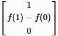。


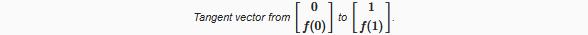

这当然是对切向量的粗略近似。它把整个纹理当作一个线性的斜率。我们可以通过采样两个距离更近的点来做得更好。例如，U坐标取0和1/2.在两个点之间的变化率是f(1/2 )-f(0)。半个单位的U。因为处理每整个单位的变化率比较简单，我们用它除以两点之间的距离。所以我们得到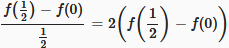。这就得到了切向量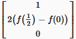。

一般来说，我们要做的是相对于我们渲染的每个片段的U坐标。到下一点的距离由一个常数定义。它的导数是通过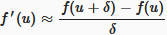来近似。

δ越小，我们近似的导数就越接近于真实。当然它不可能变成零，但当达到理论极限时，你得到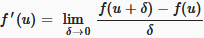。这种近似导数的方法称为有限差分法。有了它，我们可以构造任意点的切向量，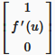。

## 从切线到法线

在我们的着色器代码中，可以用什么值去当作是δ 。最小的感知差异将覆盖我们纹理的单个像素。我们可以通过一个带有_TexelSize后缀float4类型的变量在着色器中获取这些信息。Unity设置那些变量，类似于__ST变量。

**_TexelSize变量中存储了什么？**

> 它的前两个分量包含了Texel的大小，就像U和V一样。其他两个分量包含像素的数量。例如，在256×128大小的纹理中，它将包含(0.00390625, 0.0078125, 256, 128)。

现在我们可以对纹理采样两次，计算高度导数，并构造一个切向量。我们直接用它作为法向量。

```c
    float2 delta = float2(_HeightMap_TexelSize.x, 0);
	float h1 = tex2D(_HeightMap, i.uv);
	float h2 = tex2D(_HeightMap, i.uv + delta);
	i.normal = float3(1, (h2 - h1) / delta.x, 0);

	i.normal = normalize(i.normal);
```

事实上，因为我们会归一化。我们可以扩展我们的切向量δ。这消除了除法并提高了精度。

```c
i.normal = float3(delta.x, h2 - h1, 0);
```


我们得到了一个非常明显的结果。这是因为这些高度只有一个单位范围，这就产生了非常陡峭的斜坡。由于扰动的法线并不会改变表面，所以我们不希望有如此大的差异。我们可以用任意因子来缩放高度。让我们将范围缩小到单个Texel。我们可以通过乘以δ的高度差，或简单地在切向处用1取代δ。

```c
	i.normal = float3(1, h2 - h1, 0);
```


这看起来不错，但是灯光不对。这看起来太暗了。因为我们直接用正切作为法向量。为了把它变成一个向上的法向量，我们必须绕Z轴旋转tangent 90°。

```c
i.normal = float3(h1 - h2, 1, 0);
```


**矢量旋转是如何工作的？**

你可以通过交换向量的X和Y向量，以及翻转新的X分量的符号来逆时针旋转一个2D向量90°。最后得到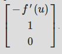


## 中心差分

我们已经使用有限差分近似来创建法向量。具体来说，是通过使用正向差分法。我们取一个点，然后看一个方向来确定斜率。结果，法线是偏向那个方向的。为了得到法向的更好的近似值，我们可以在两个方向上偏移采样点。这种方法将线性逼近集中在当前点上，称为中心差分法。这就把导数变成了。

```c
	float2 delta = float2(_HeightMap_TexelSize.x * 0.5, 0);
	float h1 = tex2D(_HeightMap, i.uv - delta);
	float h2 = tex2D(_HeightMap, i.uv + delta);
	i.normal = float3(h1 - h2, 1, 0);
```

这稍微移动了凹凸点，使它们更好地与高度场对齐。除此之外，它们的形状不会改变。

## 使用两个维度

我们创建的法线只考虑沿U方向的变化。我们已经使用了函数f(u,v)关于u的偏微分。就是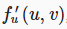，或者简写为 f<sub>u</sub><sup>‘</sup>。我们可以通过使用f<sub>u</sub><sup>’</sup>沿着V创建法线。在这种情况下，那么切向量是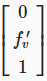并且法向量是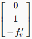。

```c
float2 du = float2(_HeightMap_TexelSize.x * 0.5, 0);
	float u1 = tex2D(_HeightMap, i.uv - du);
	float u2 = tex2D(_HeightMap, i.uv + du);
	i.normal = float3(u1 - u2, 1, 0);

	float2 dv = float2(0, _HeightMap_TexelSize.y * 0.5);
	float v1 = tex2D(_HeightMap, i.uv - dv);
	float v2 = tex2D(_HeightMap, i.uv + dv);
	i.normal = float3(0, 1, v1 - v2);

	i.normal = normalize(i.normal);
```


我们现在可以得到U和V的切线。这些向量一起描述了在片段处表面的高度场。通过计算他们的外积，我们的得到了二维高度场的法向量。

```c
float2 du = float2(_HeightMap_TexelSize.x * 0.5, 0);
	float u1 = tex2D(_HeightMap, i.uv - du);
	float u2 = tex2D(_HeightMap, i.uv + du);
	float3 tu = float3(1, u2 - u1, 0);

	float2 dv = float2(0, _HeightMap_TexelSize.y * 0.5);
	float v1 = tex2D(_HeightMap, i.uv - dv);
	float v2 = tex2D(_HeightMap, i.uv + dv);
	float3 tv = float3(0, v2 - v1, 1);

	i.normal = cross(tv, tu);
	i.normal = normalize(i.normal);
```


当你计算切向量的外积时，你会看到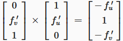。	所以我们可以直接构造这个向量，而不是依赖于叉乘函数。

```c
void InitializeFragmentNormal(inout Interpolators i) {
	float2 du = float2(_HeightMap_TexelSize.x * 0.5, 0);
	float u1 = tex2D(_HeightMap, i.uv - du);
	float u2 = tex2D(_HeightMap, i.uv + du);
//	float3 tu = float3(1, u2 - u1, 0);

	float2 dv = float2(0, _HeightMap_TexelSize.y * 0.5);
	float v1 = tex2D(_HeightMap, i.uv - dv);
	float v2 = tex2D(_HeightMap, i.uv + dv);
//	float3 tv = float3(0, v2 - v1, 1);

//	i.normal = cross(tv, tu);
	i.normal = float3(u1 - u2, 1, v1 - v2);
	i.normal = normalize(i.normal);
}
```

# 法线映射

当凹凸贴图工作时，我们必须执行多个纹理样本和有限差分计算。这似乎是一种浪费，因为结果的法线应该总是相同的。为什么每帧做所有这些工作？我们可以只做一次，将法线存储在一个纹理中。

这意味着我们需要一个法线贴图。我可以提供一个，但我们可以让Unity为我们做这些工作。将高度贴图的纹理类型改为法线贴图。Unity自动切换纹理去使用三线性过滤，并假设我们想要使用灰度图像数据来生成一个法线贴图。这正是我们想要的。但是将凹凸度为更低的值，比如0.05。


应用了导入设置后，Unity将计算法线贴图。原始的高度地图仍然存在，但Unity内部使用生成的地图。

就像我们在法线可视化为颜色时所做的那样，它们必须进行调整以适应0-1的范围。所以它们被存储为

$$
x = \frac{N+1}{2}
$$

这假设平坦区域会呈现浅绿色。然而，它们却呈现为淡蓝色。这是因为法向纹理最常见的约定是将向上的方向存储在z分量中。在Unity看来，Y和Z坐标是交换的。

## 对法线贴图采样

因为法线贴图和高度贴图有很大的不同，要相应地重命名着色器属性。

```c
Properties {
		_Tint ("Tint", Color) = (1, 1, 1, 1)
		_MainTex ("Albedo", 2D) = "white" {}
		[NoScaleOffset] _NormalMap ("Normals", 2D) = "bump" {}
//		[NoScaleOffset] _HeightMap ("Heights", 2D) = "gray" {}
		[Gamma] _Metallic ("Metallic", Range(0, 1)) = 0
		_Smoothness ("Smoothness", Range(0, 1)) = 0.1
	}
```


我们可以删除所有的高度贴图代码，并将其替换为一个纹理采样，然后进行归一化。

```c
sampler2D _NormalMap;

//sampler2D _HeightMap;
//float4 _HeightMap_TexelSize;

…

void InitializeFragmentNormal(inout Interpolators i) {
	i.normal = tex2D(_NormalMap, i.uv).rgb;
	i.normal = normalize(i.normal);
}
```

当然，我们必须通过计算2N-1来将法线转换回它们原来的-1~1的范围。

```c
i.normal = tex2D(_NormalMap, i.uv).xyz * 2 - 1;
```

此外，记得要交换Y和Z。

```c
    i.normal = tex2D(_NormalMap, i.uv).xyz * 2 - 1;
	i.normal = i.normal.xzy;
```


