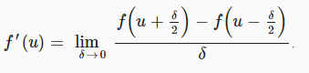

> 扰动法线模拟凹凸
>
> 从高度场计算法线
>
> 采样和混合法线
>
> 从切线空间转换为世界空间

这是渲染教程系列的第6部分。前一部分增加了对更复杂的照明的支持。这一次，我们将创建更复杂表面的错觉。

本教程是用Unity 5.4.0f3制作的。


# 凹凸映射

我们可以使用反照率纹理来创建具有复杂颜色图案的材质。我们可以用法线来调整表面的曲率。有了这些工具，我们可以制造出各种各样的表面。然而，一个三角形的表面总是光滑的。它只能在三个法向量之间插值。所以它不能代表粗糙或多变的表面。当放弃反照率纹理而只使用一种纯色时，这一点就很明显了。

体现平滑度的一个很好的例子是一个简单的四边形。添加一个到场景中，通过沿着x轴旋转90°，并使它指向上方。


因为默认的天空盒非常亮，很难看到其他灯光的作用。在本教程中，我们将其关闭。你可以通过在照明设置中将环境强度降低到零来做到这一点。然后只开启主方向灯。在场景视图中找到一个好的视角，这样你就可以在四边形上看到一些光线的差异。


我们怎样才能使这个四边形看起来不平坦呢？我们可以通过在反照率纹理中加入烘焙阴影来模拟粗糙度。然而，这将是完全静态的。如果灯光改变了，或者物体移动了，阴影也应该改变。否则，假象就会破灭。在镜面反射的情况下，甚至相机都不允许移动。

我们可以改变法线来创建曲面的错觉。但是每四个顶点只有四个法线。这只能产生平滑的过渡。如果我们想要一个多变而粗糙的表面，我们需要更多的法线。

我们可以把四边形分成更小的四边形。这给了我们更多的法线。事实上，一旦我们有更多的顶点，我们也可以移动它们。那么我们就不需要表面粗糙的假象了，我们可以做出一个真正粗糙的表面！但是子四边形仍然有同样的问题。我们还要再细分吗？这将导致大量的网格与大量的三角形。这在创建3D模型时是可行的，但在游戏中并不可行。

## 高度纹理

与平面相比，粗糙的表面具有不均匀的仰角。如果我们将这些高度数据存储在纹理中，我们可能会使用它生成的每个片段的法向量，而不是每个顶点。这个想法被称为凹凸映射，是由James Blinn首先提出的。

这是一个高度贴图，以配合我们的大理石纹理。它是一个RGB纹理，每个通道都设置相同的值。使用默认导入设置其导入到项目中。


添加一个_HeightMap纹理属性到*My First Lighting Shader*。因为它将使用与我们的反照率相同的UV，所以它不需要自己的缩放和偏移参数。默认的纹理并不重要，只要它是一致的。灰色的就可以了。

```c
	Properties {
		_Tint ("Tint", Color) = (1, 1, 1, 1)
		_MainTex ("Albedo", 2D) = "white" {}
		[NoScaleOffset] _HeightMap ("Heights", 2D) = "gray" {}
		[Gamma] _Metallic ("Metallic", Range(0, 1)) = 0
		_Smoothness ("Smoothness", Range(0, 1)) = 0.1
	}
```


将匹配的变量添加到My Lighting 包含文件中，这样我们就可以访问纹理了。让我们看看它是怎样的，把它与反照率相乘。

```c
float4 _Tint;
sampler2D _MainTex;
float4 _MainTex_ST;

sampler2D _HeightMap;

…

float4 MyFragmentProgram (Interpolators i) : SV_TARGET {
	i.normal = normalize(i.normal);

	float3 viewDir = normalize(_WorldSpaceCameraPos - i.worldPos);

	float3 albedo = tex2D(_MainTex, i.uv).rgb * _Tint.rgb;
	albedo *= tex2D(_HeightMap, i.uv);

	…
}
```


## 调整法线

因为我们的片段法线将变得更加复杂，我们将它们的初始化移到一个单独的函数中。另外，去掉高度纹理测试代码。

```c
void InitializeFragmentNormal(inout Interpolators i) {
	i.normal = normalize(i.normal);
}

float4 MyFragmentProgram (Interpolators i) : SV_TARGET {
	InitializeFragmentNormal(i);

	float3 viewDir = normalize(_WorldSpaceCameraPos - i.worldPos);

	float3 albedo = tex2D(_MainTex, i.uv).rgb * _Tint.rgb;
//	albedo *= tex2D(_HeightMap, i.uv);

	…
}
```

因为我们现在处理的是一个位于XZ平面上的四边形，它的法向量总是（0，1，0），所以我们可以使用一个常数法向量，忽略顶点数据。我们先做这个，稍后再考虑不同的朝向。

```c
void InitializeFragmentNormal(inout Interpolators i) {
	i.normal = float3(0, 1, 0);
	i.normal = normalize(i.normal);
}
```

我们怎么把高度数据包含进来呢？一种简单的方法是在归一化之前使用高度作为法线的Y分量。

```c
void InitializeFragmentNormal(inout Interpolators i) {
	float h = tex2D(_HeightMap, i.uv);
	i.normal = float3(0, h, 0);
	i.normal = normalize(i.normal);
}
```


这是行不通的，因为归一化会把每个向量都转换回（0，1，0）.我们需要一个不同的方法。

## 有限差分

因为我们处理的是纹理数据，我们有二维数据。有U维度和V维度。这些高度可以被认为是在三维空间中向上的。我们可以说纹理代表了一个函数，f(u,v)=h。我们先把自己限制在U维度上。所以这个函数被简化为f（u）=h。我们能从这个函数推出法向量吗？

如果我们知道函数的斜率，然后我们就可以用它来计算任意点的法向量。斜率由h的变化率决定。这是它的导数。h′。因为h是一个函数的结果，h‘同样也是一个函数的结果。我们有导数函数f’(u)=h‘。

不幸的是，我们不知道这些函数是什么。但是我们可以近似它们。我们可以比较纹理中两个不同点的高度。例如，在极端情况下，使用U坐标0和1。这两个样本之间的插值就是坐标之间的变化率，用函数表示，即f(1)-f(0)。我们可以使用它来构建一个切线向量，。


这当然是对切向量的粗略近似。它把整个纹理当作一个线性的斜率。我们可以通过采样两个距离更近的点来做得更好。例如，U坐标取0和1/2.在两个点之间的变化率是f(1/2 )-f(0)。半个单位的U。因为处理每整个单位的变化率比较简单，我们用它除以两点之间的距离。所以我们得到。这就得到了切向量。

一般来说，我们要做的是相对于我们渲染的每个片段的U坐标。到下一点的距离由一个常数定义。它的导数是通过来近似。

δ越小，我们近似的导数就越接近于真实。当然它不可能变成零，但当达到理论极限时，你得到。这种近似导数的方法称为有限差分法。有了它，我们可以构造任意点的切向量，。

## 从切线到法线

在我们的着色器代码中，可以用什么值去当作是δ 。最小的感知差异将覆盖我们纹理的单个像素。我们可以通过一个带有_TexelSize后缀float4类型的变量在着色器中获取这些信息。Unity设置那些变量，类似于__ST变量。

**_TexelSize变量中存储了什么？**

> 它的前两个分量包含了Texel的大小，就像U和V一样。其他两个分量包含像素的数量。例如，在256×128大小的纹理中，它将包含(0.00390625, 0.0078125, 256, 128)。

现在我们可以对纹理采样两次，计算高度导数，并构造一个切向量。我们直接用它作为法向量。

```c
    float2 delta = float2(_HeightMap_TexelSize.x, 0);
	float h1 = tex2D(_HeightMap, i.uv);
	float h2 = tex2D(_HeightMap, i.uv + delta);
	i.normal = float3(1, (h2 - h1) / delta.x, 0);

	i.normal = normalize(i.normal);
```

事实上，因为我们会归一化。我们可以扩展我们的切向量δ。这消除了除法并提高了精度。

```c
i.normal = float3(delta.x, h2 - h1, 0);
```


我们得到了一个非常明显的结果。这是因为这些高度只有一个单位范围，这就产生了非常陡峭的斜坡。由于扰动的法线并不会改变表面，所以我们不希望有如此大的差异。我们可以用任意因子来缩放高度。让我们将范围缩小到单个Texel。我们可以通过乘以δ的高度差，或简单地在切向处用1取代δ。

```c
	i.normal = float3(1, h2 - h1, 0);
```


这看起来不错，但是灯光不对。这看起来太暗了。因为我们直接用正切作为法向量。为了把它变成一个向上的法向量，我们必须绕Z轴旋转tangent 90°。

```c
i.normal = float3(h1 - h2, 1, 0);
```


**矢量旋转是如何工作的？**

你可以通过交换向量的X和Y向量，以及翻转新的X分量的符号来逆时针旋转一个2D向量90°。最后得到


## 中心差分

我们已经使用有限差分近似来创建法向量。具体来说，是通过使用正向差分法。我们取一个点，然后看一个方向来确定斜率。结果，法线是偏向那个方向的。为了得到法向的更好的近似值，我们可以在两个方向上偏移采样点。这种方法将线性逼近集中在当前点上，称为中心差分法。这就把导数变成了。

```c
	float2 delta = float2(_HeightMap_TexelSize.x * 0.5, 0);
	float h1 = tex2D(_HeightMap, i.uv - delta);
	float h2 = tex2D(_HeightMap, i.uv + delta);
	i.normal = float3(h1 - h2, 1, 0);
```

这稍微移动了凹凸点，使它们更好地与高度场对齐。除此之外，它们的形状不会改变。

## 使用两个维度

我们创建的法线只考虑沿U方向的变化。我们已经使用了函数f(u,v)关于u的偏微分。就是，或者简写为 f<sub>u</sub><sup>‘</sup>。我们可以通过使用f<sub>u</sub><sup>’</sup>沿着V创建法线。在这种情况下，那么切向量是并且法向量是。

```c
float2 du = float2(_HeightMap_TexelSize.x * 0.5, 0);
	float u1 = tex2D(_HeightMap, i.uv - du);
	float u2 = tex2D(_HeightMap, i.uv + du);
	i.normal = float3(u1 - u2, 1, 0);

	float2 dv = float2(0, _HeightMap_TexelSize.y * 0.5);
	float v1 = tex2D(_HeightMap, i.uv - dv);
	float v2 = tex2D(_HeightMap, i.uv + dv);
	i.normal = float3(0, 1, v1 - v2);

	i.normal = normalize(i.normal);
```


我们现在可以得到U和V的切线。这些向量一起描述了在片段处表面的高度场。通过计算他们的外积，我们的得到了二维高度场的法向量。

```c
float2 du = float2(_HeightMap_TexelSize.x * 0.5, 0);
	float u1 = tex2D(_HeightMap, i.uv - du);
	float u2 = tex2D(_HeightMap, i.uv + du);
	float3 tu = float3(1, u2 - u1, 0);

	float2 dv = float2(0, _HeightMap_TexelSize.y * 0.5);
	float v1 = tex2D(_HeightMap, i.uv - dv);
	float v2 = tex2D(_HeightMap, i.uv + dv);
	float3 tv = float3(0, v2 - v1, 1);

	i.normal = cross(tv, tu);
	i.normal = normalize(i.normal);
```


当你计算切向量的外积时，你会看到。	所以我们可以直接构造这个向量，而不是依赖于叉乘函数。

```c
void InitializeFragmentNormal(inout Interpolators i) {
	float2 du = float2(_HeightMap_TexelSize.x * 0.5, 0);
	float u1 = tex2D(_HeightMap, i.uv - du);
	float u2 = tex2D(_HeightMap, i.uv + du);
//	float3 tu = float3(1, u2 - u1, 0);

	float2 dv = float2(0, _HeightMap_TexelSize.y * 0.5);
	float v1 = tex2D(_HeightMap, i.uv - dv);
	float v2 = tex2D(_HeightMap, i.uv + dv);
//	float3 tv = float3(0, v2 - v1, 1);

//	i.normal = cross(tv, tu);
	i.normal = float3(u1 - u2, 1, v1 - v2);
	i.normal = normalize(i.normal);
}
```

# 法线映射

当凹凸贴图工作时，我们必须执行多个纹理样本和有限差分计算。这似乎是一种浪费，因为结果的法线应该总是相同的。为什么每帧做所有这些工作？我们可以只做一次，将法线存储在一个纹理中。

这意味着我们需要一个法线贴图。我可以提供一个，但我们可以让Unity为我们做这些工作。将高度贴图的纹理类型改为法线贴图。Unity自动切换纹理去使用三线性过滤，并假设我们想要使用灰度图像数据来生成一个法线贴图。这正是我们想要的。但是将凹凸度为更低的值，比如0.05。


应用了导入设置后，Unity将计算法线贴图。原始的高度地图仍然存在，但Unity内部使用生成的地图。

就像我们在法线可视化为颜色时所做的那样，它们必须进行调整以适应0-1的范围。所以它们被存储为

$$
x = \frac{N+1}{2}
$$

这假设平坦区域会呈现浅绿色。然而，它们却呈现为淡蓝色。这是因为法向纹理最常见的约定是将向上的方向存储在z分量中。在Unity看来，Y和Z坐标是交换的。

## 对法线贴图采样

因为法线贴图和高度贴图有很大的不同，要相应地重命名着色器属性。

```c
Properties {
		_Tint ("Tint", Color) = (1, 1, 1, 1)
		_MainTex ("Albedo", 2D) = "white" {}
		[NoScaleOffset] _NormalMap ("Normals", 2D) = "bump" {}
//		[NoScaleOffset] _HeightMap ("Heights", 2D) = "gray" {}
		[Gamma] _Metallic ("Metallic", Range(0, 1)) = 0
		_Smoothness ("Smoothness", Range(0, 1)) = 0.1
	}
```


我们可以删除所有的高度贴图代码，并将其替换为一个纹理采样，然后进行归一化。

```c
sampler2D _NormalMap;

//sampler2D _HeightMap;
//float4 _HeightMap_TexelSize;

…

void InitializeFragmentNormal(inout Interpolators i) {
	i.normal = tex2D(_NormalMap, i.uv).rgb;
	i.normal = normalize(i.normal);
}
```

当然，我们必须通过计算2N-1来将法线转换回它们原来的-1~1的范围。

```c
i.normal = tex2D(_NormalMap, i.uv).xyz * 2 - 1;
```

此外，记得要交换Y和Z。

```c
    i.normal = tex2D(_NormalMap, i.uv).xyz * 2 - 1;
	i.normal = i.normal.xzy;
```


## DXT5nm

我们的法线肯定是有一些问题的。这是因为Unity最终以一种不同于我们预期的方式对法线进行编码。即使纹理预览是RGB编码。Unity实际上使用的是DXT5nm。

DXT5nm格式只存储法线的X和Y分量。它的Z分量被丢弃。正如你所期望的，Y分量存储在G通道中。但是，X分量存储在A通道中。没有使用R和B通道。

因此，当使用DXT5nm时，我们只能检索正常的前两个分量。

```c
	i.normal.xy = tex2D(_NormalMap, i.uv).wy * 2 - 1;
```

我们必须从其他两项中推断出第三项。因为法向量是单位向量。

$$
||N||^2=N_x^2+N_y^2+N_z^2=1。然后N_z=\sqrt[]{1-N_x^2-N_y^2}。
$$

```c
        i.normal.xy = tex2D(_NormalMap, i.uv).wy * 2 - 1;
	i.normal.z = sqrt(1 - dot(i.normal.xy, i.normal.xy));
	i.normal = i.normal.xzy;
```

理论上，结果应该等于原始的Z分量。但是，由于纹理的精度有限，而且由于纹理滤波，结果往往有所不同，不过已经很接近了。

此外，由于精度限制，
$$
N_x^2+N_y^2
$$

可能会超出界限。通过限制点积，确保不会发生这种事情。

```c
i.normal.z = sqrt(1 - saturate(dot(i.normal.xy, i.normal.xy)));
```


## 缩放凹凸

因为我们把法线烘焙成纹理，我们不能在片段着色器中缩放它。

我们可以在计算Z之前缩放法线的X和Y分量。如果我们减少X和Y，那么Z会变大，导致一个更平坦的表面。如果我们增加它们，相反的情况会发生。我们可以这样调整凹凸度。因为我们已经限制和X和Y的平方，我们永远不会得到无效的法线。

让我们添加一个凹凸缩放属性到我们的着色器，就像Unity的标准着色器一样。

```c
Properties {
		_Tint ("Tint", Color) = (1, 1, 1, 1)
		_MainTex ("Albedo", 2D) = "white" {}
		[NoScaleOffset] _NormalMap ("Normals", 2D) = "bump" {}
		_BumpScale ("Bump Scale", Float) = 1
		[Gamma] _Metallic ("Metallic", Range(0, 1)) = 0
		_Smoothness ("Smoothness", Range(0, 1)) = 0.1
	}
```

把这个缩放纳入我们的正常计算。

```c
sampler2D _NormalMap;
float _BumpScale;

…

void InitializeFragmentNormal(inout Interpolators i) {
	i.normal.xy = tex2D(_NormalMap, i.uv).wy * 2 - 1;
	i.normal.xy *= _BumpScale;
	i.normal.z = sqrt(1 - saturate(dot(i.normal.xy, i.normal.xy)));
	i.normal = i.normal.xzy;
	i.normal = normalize(i.normal);
}
```

要得到和我们使用高度贴图时差不多的强度，把缩放降低到0.25左右。


UnityStandardUtils包含了UnpackScaleNormal函数。它会自动地为法线贴图使用正确的编码，并且缩放法线。所以，让我们用这个方便的函数。

```c
void InitializeFragmentNormal(inout Interpolators i) {
//	i.normal.xy = tex2D(_NormalMap, i.uv).wy * 2 - 1;
//	i.normal.xy *= _BumpScale;
//	i.normal.z = sqrt(1 - saturate(dot(i.normal.xy, i.normal.xy)));
	i.normal = UnpackScaleNormal(tex2D(_NormalMap, i.uv), _BumpScale);
	i.normal = i.normal.xzy;
	i.normal = normalize(i.normal);
}
```

## 合并反照率和凹凸

现在我们有了一个有功能的法线贴图。你可以检查她的不同之处。当只使用大理石反照率纹理，我们的四方网格看起来像完美抛光的石头。添加了法线纹理之后，它会变得有更多的细节。


# 凹凸细节

在第3部分——合并纹理中，我们创建了一个带有细节纹理的着色器。我们那是用反照率去实现的，但现在我们也可以用凹凸纹理来实现。首先，添加对细节反照率支持到My First Lighting着色器中。

```c
Properties {
		_Tint ("Tint", Color) = (1, 1, 1, 1)
		_MainTex ("Albedo", 2D) = "white" {}
		[NoScaleOffset] _NormalMap ("Normals", 2D) = "bump" {}
		_BumpScale ("Bump Scale", Float) = 1
		[Gamma] _Metallic ("Metallic", Range(0, 1)) = 0
		_Smoothness ("Smoothness", Range(0, 1)) = 0.1
		_DetailTex ("Detail Texture", 2D) = "gray" {}
	}
```


我们不需要为细节纹理UV添加到一个插值器中，二十手动将主UV和细节纹理UV打包到一个插值器中。主纹理UV是XY，细节纹理的UV是ZW。

```c
struct Interpolators {
	float4 position : SV_POSITION;
//	float2 uv : TEXCOORD0;
	float4 uv : TEXCOORD0;
	float3 normal : TEXCOORD1;
	float3 worldPos : TEXCOORD2;

	#if defined(VERTEXLIGHT_ON)
		float3 vertexLightColor : TEXCOORD3;
	#endif
};
```

添加所需的变量，然后在顶点程序中填入插值器。

```c
sampler2D _MainTex, _DetailTex;
sampler2D _MainTex, _DetailTex;
float4 _MainTex_ST, _DetailTex_ST;

…

Interpolators MyVertexProgram (VertexData v) {
	Interpolators i;
	i.position = mul(UNITY_MATRIX_MVP, v.position);
	i.worldPos = mul(unity_ObjectToWorld, v.position);
	i.normal = UnityObjectToWorldNormal(v.normal);
	i.uv.xy = TRANSFORM_TEX(v.uv, _MainTex);
	i.uv.zw = TRANSFORM_TEX(v.uv, _DetailTex);
	ComputeVertexLightColor(i);
	return i;
}
```

现在当我们使用主纹理UV时，应该使用i.uv.xy而不是i.uv。

```c
void InitializeFragmentNormal(inout Interpolators i) {
	i.normal = UnpackScaleNormal(tex2D(_NormalMap, i.uv.xy), _BumpScale);
	i.normal = i.normal.xzy;
	i.normal = normalize(i.normal);
}

float4 MyFragmentProgram (Interpolators i) : SV_TARGET {
	InitializeFragmentNormal(i);

	float3 viewDir = normalize(_WorldSpaceCameraPos - i.worldPos);

	float3 albedo = tex2D(_MainTex, i.uv.xy).rgb * _Tint.rgb;

	…
}
```

将细节纹理作为一个因子与反照率相乘。

```c
	float3 albedo = tex2D(_MainTex, i.uv.xy).rgb * _Tint.rgb;
	albedo *= tex2D(_DetailTex, i.uv.zw) * unity_ColorSpaceDouble;
```


## 细节法线贴图

由于大理石材质的细节纹理时灰度值，我们可以使用它来生成法线贴图。赋值它并将其导入类型更改为Normal Map。把它的凹凸值降低到0.1左右，保持其他设置不变。

As we're fading out the mipmaps, the colors fade to gray. As a result, the detail normal map that Unity generates fades to flat. So they fade out together.


为细节法线添加一个属性到我们的着色器中，并赋予它一个凹凸缩放。

```c
Properties {
		_Tint ("Tint", Color) = (1, 1, 1, 1)
		_MainTex ("Albedo", 2D) = "white" {}
		[NoScaleOffset] _NormalMap ("Normals", 2D) = "bump" {}
		_BumpScale ("Bump Scale", Float) = 1
		[Gamma] _Metallic ("Metallic", Range(0, 1)) = 0
		_Smoothness ("Smoothness", Range(0, 1)) = 0.1
		_DetailTex ("Detail Texture", 2D) = "gray" {}
		[NoScaleOffset] _DetailNormalMap ("Detail Normals", 2D) = "bump" {}
		_DetailBumpScale ("Detail Bump Scale", Float) = 1
	}
```


添加所需的变量并获取细节法线纹理，就像主法线纹理一样。在我们合并它们之前，显示正常的细节法线。

```c
sampler2D _NormalMap, _DetailNormalMap;
float _BumpScale, _DetailBumpScale;

…

void InitializeFragmentNormal(inout Interpolators i) {
	i.normal = UnpackScaleNormal(tex2D(_NormalMap, i.uv.xy), _BumpScale);
	i.normal =
		UnpackScaleNormal(tex2D(_DetailNormalMap, i.uv.zw), _DetailBumpScale);
	i.normal = i.normal.xzy;
	i.normal = normalize(i.normal);
}
```


## 合并法线

我们把主反照率和细节反照率相乘。我们不能用法线，因为它们是向量。但我们可以在归一化之前对它们进行平均。

```c
void InitializeFragmentNormal(inout Interpolators i) {
	float3 mainNormal =
		UnpackScaleNormal(tex2D(_NormalMap, i.uv.xy), _BumpScale);
	float3 detailNormal =
		UnpackScaleNormal(tex2D(_DetailNormalMap, i.uv.zw), _DetailBumpScale);
	i.normal = (mainNormal + detailNormal) * 0.5;
	i.normal = i.normal.xzy;
	i.normal = normalize(i.normal);
}
```


结果不是很好。主纹理凹凸和细节纹理凹凸都变得平坦了。理想情况下，当其中一个是平的，它不应该影响到另一个。

这里我们需要做的是，合并两个高度场。求平均值是没有意义的，要把它们相加才有意义。当添加两个高度场时，它们的斜率——也就是它们的导数——也会被添加。我们能从法线中提取出导数吗？

早些时候，我们构建自己的法向量通过归一化

$$
\left[ \begin{matrix} 
-f_u'\\
 1\\ 
-f_v'\\ 
\end{matrix} \right]
$$

我们的法线纹理包含相同类型的法线，只是它们的Y和Z分量交换了。所以它们变成了这样的形式

$$
\left[ \begin{matrix} 
-f_u'\\
-f_v'\\ 
 1\\ 
\end{matrix} \right]
$$

然而，这些法线已经被归一化过程缩放了。所以我们把它变成
$$
\left[ \begin{matrix} 
-sf_u'\\
-sf_v'\\ 
 s\\ 
\end{matrix} \right]
$$

其中是是任意的比例因子。Z分量等于这个因子。这意味着我们可以用X和Y除以Z来求偏导，只有当Z等于0时，它才会无效，因为Z等于0对应于一个垂直的表面。我们的凹凸远没有那么陡峭，所以我们不必担心。

一旦我们有了导数，我们可以把它们加起来求出求和高度场的导数。
然后，我们把它转成法向量。结果是一个向量，在归一化之前，它是
$$
\left[ \begin{matrix} 
\frac{M_x}{M_z}+\frac{D_x}{D_z}   \\
\frac{M_y}{M_z}+\frac{D_y}{D_z}   \\ 
 1      \\ 
\end{matrix} \right]
$$

```c
void InitializeFragmentNormal(inout Interpolators i) {
	float3 mainNormal =
		UnpackScaleNormal(tex2D(_NormalMap, i.uv.xy), _BumpScale);
	float3 detailNormal =
		UnpackScaleNormal(tex2D(_DetailNormalMap, i.uv.zw), _DetailBumpScale);
	i.normal =
		float3(mainNormal.xy / mainNormal.z + detailNormal.xy / detailNormal.z, 1);
	i.normal = i.normal.xzy;
	i.normal = normalize(i.normal);
}
```


这产生了一个更好的结果。它在合并大部分是平的贴图时工作得很好。然而，合并陡峭的坡仍将失去细节。一种可选方法是whiteout blending。首先，将新法线乘以

$$
M_zD_z
$$

我们可以这样做，因为不管怎样，我们之后都会归一化。这样我们就会得到这样的向量 
$$
\left[ \begin{matrix} 
M_xD_z+D_xM_z \\
M_yD_z+D_yM_z\\ 
 M_zD_z      \\ 
\end{matrix} \right]
$$

然后去掉X和Y的缩放，得到

$$
\left
[
\begin{matrix}
M_x+D_x\\
M_y+D_y\\
M_zD_z
\end{matrix}

\right]
$$

这一调整，放大了X和Y分量，因此在陡坡上产生了更明显的颠簸。但是，当一个法线是平的时候，另一个法线不会改变。

为什么被称为whiteout blending？

> 这种方法是由Christopher Oat在SIGGRAPH ' 07年首次公开描述的。它曾用于AMD的Ruby: Whiteout演示，因此得名。

```c
i.normal =
		float3(mainNormal.xy + detailNormal.xy, mainNormal.z * detailNormal.z);
//		float3(mainNormal.xy / mainNormal.z + detailNormal.xy / detailNormal.z, 1);
```


UnityStandardUtils包含BlendNormals函数，该函数也使用了whiteout混合。我们来看这个函数。它也对结果归一化了，所以我们不再需要自己去做。

```c
i.normal = BlendNormals(mainNormal, detailNormal);
//		float3(mainNormal.xy + detailNormal.xy, mainNormal.z * detailNormal.z);
	i.normal = i.normal.xzy;
//	i.normal = normalize(i.normal);
```

# 切线空间

到目前为止，我们已经假设我们正在着色一个与XZ平面对齐的平面。但是要使这项技术有实际作用，它必须适用于任意的几何形状。


立方体的一个面可以被对齐，这样它就符合我们的假设。我们可以支持另一边，通过交换和翻转维度。但这是假设一个立方体是轴向的。当立方体任意旋转时，它会变得更复杂。我们必须转换凹凸贴图代码的结果，这样它才能与人脸的真实方向相匹配。

我们能知道人脸的方位吗?为此，我们需要定义U和V轴的向量。这两个，加上法向量，定义了一个符合我们假设的三维空间。一旦我们有了这样的空间，我们就可以用它来把这些凹凸变成世界空间的了。

因为我们已经有了法向量_N_，我们只需要一个额外的向量。这两个向量的外积定义了第三个向量。

附加向量作为网格顶点数据的一部分提供。因为它位于曲面法向量定义的平面上，所以它被称为切向量_T_。根据惯例，这个向量与U轴相匹配，指向右边。

第三个向量被称为_B_，即副法线。正如Unity将其称为副法线一样，_I_也将如此。这个向量定义了指向前方的V轴。推导bitangent的标准方法是_B=N×T_。然而，这将产生一个指向后的向量，而不是指向前的向量。要纠正这个错误，结果必须乘以- 1。这个因子被存储为_T_的一个额外的第四个分量。

因此我们可以使用顶点法线和切线来构建一个与网格表面匹配的三维空间。这个空间被称为正切空间，正切基，或者TBN空间。对于立方体，每个面的切线空间是一致的。在球面的情况下，切线空间环绕其表面。

为了构造这个空间，网格必须包含切向量。幸运的是，Unity的默认网格包含了这些数据。当你导入一个网格到Unity中，你要么导入你自己的切线，要么让Unity为你生成它们。

## 可视化切线空间

为了了解切线空间是如何工作的，让我们编写一个它的快速可视化代码。使用OnDrawGizmos方法创建一个TangentSpaceVisualizer组件。

```cs
using UnityEngine;

public class TangentSpaceVisualizer : MonoBehaviour {

	void OnDrawGizmos () {
	}
}
```

每次绘制gizmos时，从游戏对象的mesh filter中抓取网格，并使用它来显示其切线空间。当然，这只适用于有网格的情况。选择shadedMesh，而不是mesh。第一个为我们提供了对mesh资产的引用，而第二个将创建一个副本。

**问：为什么### `[MeshFilter](http://docs.unity3d.com/Documentation/ScriptReference/MeshFilter.html).mesh`属性会创建一个副本？**
> 假设您有一个使用网格资产的游戏对象。你只需要在运行时调整游戏对象的网格。然后，您需要创建网格资产的本地副本，具体到该对象。这就是为什么MeshFilter.mesh创建一个副本。

```cs
void OnDrawGizmos () {
		MeshFilter filter = GetComponent<MeshFilter>();
		if (filter) {
			Mesh mesh = filter.sharedMesh;
			if (mesh) {
				ShowTangentSpace(mesh);
			}
		}
	}

	void ShowTangentSpace (Mesh mesh) {
	}
```

首先，我们来看法向量。从网格中获取顶点位置和法线，并使用它们来绘制直线。我们必须将它们转换成世界空间，这样它们才能与场景中的几何图形匹配。因为法线在切线空间中对应向上的方向，我们用绿色来表示。

```cs
void ShowTangentSpace (Mesh mesh) {
		Vector3[] vertices = mesh.vertices;
		Vector3[] normals = mesh.normals;
		for (int i = 0; i < vertices.Length; i++) {
			ShowTangentSpace(
				transform.TransformPoint(vertices[i]),
				transform.TransformDirection(normals[i])
			);
		}
	}

	void ShowTangentSpace (Vector3 vertex, Vector3 normal) {
		Gizmos.color = Color.green;
		Gizmos.DrawLine(vertex, vertex + normal);
	}
```

将此组件添加到一些带有网格的对象中以查看其顶点法线。


线的合理长度是多少?这取决于几何形状。我们来添加一个可配置的比例。我们还支持一个可配置的偏移量，它将线条推离表面。这使它更容易检查重叠的顶点

```cs
public float offset = 0.01f;
	public float scale = 0.1f;

	void ShowTangentSpace (Vector3 vertex, Vector3 normal) {
		vertex += normal * offset;
		Gizmos.color = Color.green;
		Gizmos.DrawLine(vertex, vertex + normal * scale);
	}
```


现在是切向量。它们和法向量一样，除了它们是四维向量。当它们指向右侧时，给它们一个红色。

```cs
void ShowTangentSpace (Mesh mesh) {
		Vector3[] vertices = mesh.vertices;
		Vector3[] normals = mesh.normals;
		Vector4[] tangents = mesh.tangents;
		for (int i = 0; i < vertices.Length; i++) {
			ShowTangentSpace(
				transform.TransformPoint(vertices[i]),
				transform.TransformDirection(normals[i]),
				transform.TransformDirection(tangents[i])
			);
		}
	}

	void ShowTangentSpace (Vector3 vertex, Vector3 normal, Vector3 tangent) {
		vertex += normal * offset;
		Gizmos.color = Color.green;
		Gizmos.DrawLine(vertex, vertex + normal * scale);
		Gizmos.color = Color.red;
		Gizmos.DrawLine(vertex, vertex + tangent * scale);
	}
```


最后，用一条蓝线构造并表示副法线向量。

```cs
void ShowTangentSpace (Mesh mesh) {
		…
		for (int i = 0; i < vertices.Length; i++) {
			ShowTangentSpace(
				transform.TransformPoint(vertices[i]),
				transform.TransformDirection(normals[i]),
				transform.TransformDirection(tangents[i]),
				tangents[i].w
			);
		}
	}

	void ShowTangentSpace (
		Vector3 vertex, Vector3 normal, Vector3 tangent, float binormalSign
	) {
		…
		Vector3 binormal = Vector3.Cross(normal, tangent) * binormalSign;
		Gizmos.color = Color.blue;
		Gizmos.DrawLine(vertex, vertex + binormal * scale);
	}
```


可以看到，对于默认立方体的每个面，切线空间是不同的，但却是恒定的。对于默认的球体，每个顶点的切线空间是不同的。因此，切线空间将通过三角形进行插值，从而得到一个弯曲空间。


在球体周围环绕切线空间是有问题的。Unity的默认球体使用经纬度纹理布局。这就像把一张纸裹在一个球上，形成一个圆柱体。然后，将圆柱体的顶部和底部弄皱，直到它们与球体匹配。所以两极很乱。Unity的默认球体结合了立方体顶点布局，这加剧了问题。它们对于模型来说很好，但是不要期望默认的网格会产生高质量的结果。

## 着色器中的切线空间

要访问着色器中的切线，必须将它们添加到VertexData结构中。

```cs
struct VertexData {
	float4 position : POSITION;
	float3 normal : NORMAL;
	float4 tangent : TANGENT;
	float2 uv : TEXCOORD0;
};
```

我们必须把它们作为一个额外的插值器。插补器的顺序不重要，但我喜欢保持法线和切线在一起。

```cs
struct Interpolators {
	float4 position : SV_POSITION;
	float4 uv : TEXCOORD0;
	float3 normal : TEXCOORD1;
	float4 tangent : TEXCOORD2;
	float3 worldPos : TEXCOORD3;

	#if defined(VERTEXLIGHT_ON)
		float3 vertexLightColor : TEXCOORD4;
	#endif
};
```

在顶点程序中转换切线到世界空间，使用UnityCG中的UnityObjectToWorldDir。当然这只适用于切线的XYZ部分。它的W组件需要不加修改地传递。

```cs
Interpolators MyVertexProgram (VertexData v) {
	Interpolators i;
	i.position = mul(UNITY_MATRIX_MVP, v.position);
	i.worldPos = mul(unity_ObjectToWorld, v.position);
	i.normal = UnityObjectToWorldNormal(v.normal);
	i.tangent = float4(UnityObjectToWorldDir(v.tangent.xyz), v.tangent.w);
	i.uv.xy = TRANSFORM_TEX(v.uv, _MainTex);
	i.uv.zw = TRANSFORM_TEX(v.uv, _DetailTex);
	ComputeVertexLightColor(i);
	return i;
}
```

现在我们可以在片段着色器中同时访问法线和切线。因此，我们可以在`InitializeFragmentNormal`中构造副法线。但是，我们必须注意不要用凹凸法线代替原来的法线。凹凸法线存在于切线空间中，所以要保持它的独立性。

```cs
void InitializeFragmentNormal(inout Interpolators i) {
	float3 mainNormal =
		UnpackScaleNormal(tex2D(_NormalMap, i.uv.xy), _BumpScale);
	float3 detailNormal =
		UnpackScaleNormal(tex2D(_DetailNormalMap, i.uv.zw), _DetailBumpScale);
	float3 tangentSpaceNormal = BlendNormals(mainNormal, detailNormal);
	tangentSpaceNormal = tangentSpaceNormal.xzy;

	float3 binormal = cross(i.normal, i.tangent.xyz) * i.tangent.w;
}
```

现在我们可以把凹凸法向量从切线空间转换成世界空间。

```cs
float3 binormal = cross(i.normal, i.tangent.xyz) * i.tangent.w;

	i.normal = normalize(
		tangentSpaceNormal.x * i.tangent +
		tangentSpaceNormal.y * i.normal +
		tangentSpaceNormal.z * binormal
	);
```

我们还可以去掉显式的YZ交换，将它与空间转换结合起来。

```cs
//	tangentSpaceNormal = tangentSpaceNormal.xzy;
	
	float3 binormal = cross(i.normal, i.tangent.xyz) * i.tangent.w;

	i.normal = normalize(
		tangentSpaceNormal.x * i.tangent +
		tangentSpaceNormal.y * binormal +
		tangentSpaceNormal.z * i.normal
	;
```


在构造副法线时，还有一个额外的细节。假设一个对象的scale设置为(- 1,1,1)，这意味着它是镜像的。在这种情况下，我们必须翻转副法线，来正确地镜像切线空间。事实上，当奇数维数为负时，我们必须这样做。UnityShaderVariables通过定义float4 unity_WorldTransformParams变量来帮助我们完成这个任务。当需要翻转副法线时，它的第四个分量为- 1，否则为1。

```cs
	float3 binormal = cross(i.normal, i.tangent.xyz) *
		(i.tangent.w * unity_WorldTransformParams.w);
```

## 同步切线空间

当一个3D艺术家创建一个详细的模型时，通常的方法是建立一个非常高分辨率的模型。所有的细节都是真实的3D几何图形。为了在游戏中实现这一点，需要生成模型的低分辨率版本。这个模型的细节被加入到纹理中。

高分辨率模型的法线被制作成法线贴图。这是通过将法向量从世界空间转换为切线空间来实现的。在游戏中渲染低分辨率模型时，这种转换是相反的。

只要两个转换使用相同的算法和切空间，这个过程就可以很好地工作。如果他们不这样做，游戏内的结果将是错误的。这可能会给3D艺术家带来很多痛苦。所以你必须确保你的法线贴图生成器、Unity的网格导入过程、以及着色器都是同步的。这就是所谓的同步切线空间工作流。

问：那法线贴图呢？

> 我们从高度场生成法线贴图。因此，它们有一个平坦的参照系，它们的切线空间是规则的。所以当它们被应用到一个具有弯曲的切线空间的物体上时，最终的法线会被扭曲，与高度场相比。这很好，因为大理石的确切外观并不重要。

从5.3版开始，Unity就使用了mikktspace。因此，在生成法线贴图时，请确保使用了mikktspace。当导入一个网格时，你可以让Unity为你生成切向量，因为它使用了mikktspace算法。或者，导出自己的mikktspace切线，让Unity使用它们。

问：什么是mikktspace？

它是Morten Mikkelsen创建的切线空间和正常生成的标准。这个名字是Mikkelsen的切线空间的缩写。
对于一个与mikktspace同步的着色器，它必须在顶点程序中接收归一化的法向量和切向量。然后插入这些向量，而不是对每个片段重新归一化。通过计算`[cross](http://developer.download.nvidia.com/cg/cross.html)(normal.**xyz**, tangent.**xyz**) * tangent.**w**`.得到副法线。所以我们的着色器是与mikktspace同步的，Unity的标准着色器也是如此。
注意，mikktspace不能保证是规则的。法线和切线之间的角度可以自由变化。这不是问题，只要失真不太严重。因为我们只使用它来转换法线，所以一致性才是最重要的。

当使用mikktspace时，有一个选择。副法线可以像我们一样在片段程序中构造，也可以像Unity一样在顶点程序中构造。这两种方法产生的副法线略有不同。


所以当你为Unity生成法线贴图时，使用与计算每个顶点的副法线相对应的设置。或者假设它们是按每个片段计算的，并使用一个着色器。

问：切线空间很麻烦，没有它我们能行吗？
。。。

## 逐顶点或者逐片段副法线计算

如果我们想与Unity的标准着色器保持一致，我们必须计算每个顶点的副法线。这样做的好处是我们不必在片段着色器中计算叉乘。缺点是我们需要一个额外的内插器。

如果不确定使用哪种方法，可以同时支持这两种方法。假设定义了BINORMAL_PER_FRAGMENT，我们计算每个片段的副法线。否则，我们对每个顶点都这样做。在前一种情况下，我们保持我们的float4 tan插值器。在后者中，我们需要两个float3插值器。

```c
struct Interpolators {
	float4 position : SV_POSITION;
	float4 uv : TEXCOORD0;
	float3 normal : TEXCOORD1;

	#if defined(BINORMAL_PER_FRAGMENT)
		float4 tangent : TEXCOORD2;
	#else
		float3 tangent : TEXCOORD2;
		float3 binormal : TEXCOORD3;
	#endif

	float3 worldPos : TEXCOORD4;

	#if defined(VERTEXLIGHT_ON)
		float3 vertexLightColor : TEXCOORD5;
	#endif
};
```

我们把副法线计算放到它自己的函数中。然后我们可以在顶点或片段着色器中使用它。

```c
float3 CreateBinormal (float3 normal, float3 tangent, float binormalSign) {
	return cross(normal, tangent.xyz) *
		(binormalSign * unity_WorldTransformParams.w);
}

Interpolators MyVertexProgram (VertexData v) {
	Interpolators i;
	i.position = mul(UNITY_MATRIX_MVP, v.position);
	i.worldPos = mul(unity_ObjectToWorld, v.position);
	i.normal = UnityObjectToWorldNormal(v.normal);

	#if defined(BINORMAL_PER_FRAGMENT)
		i.tangent = float4(UnityObjectToWorldDir(v.tangent.xyz), v.tangent.w);
	#else
		i.tangent = UnityObjectToWorldDir(v.tangent.xyz);
		i.binormal = CreateBinormal(i.normal, i.tangent, v.tangent.w);
	#endif
		
	i.uv.xy = TRANSFORM_TEX(v.uv, _MainTex);
	i.uv.zw = TRANSFORM_TEX(v.uv, _DetailTex);
	ComputeVertexLightColor(i);
	return i;
}

…

void InitializeFragmentNormal(inout Interpolators i) {
	float3 mainNormal =
		UnpackScaleNormal(tex2D(_NormalMap, i.uv.xy), _BumpScale);
	float3 detailNormal =
		UnpackScaleNormal(tex2D(_DetailNormalMap, i.uv.zw), _DetailBumpScale);
	float3 tangentSpaceNormal = BlendNormals(mainNormal, detailNormal);

	#if defined(BINORMAL_PER_FRAGMENT)
		float3 binormal = CreateBinormal(i.normal, i.tangent.xyz, i.tangent.w);
	#else
		float3 binormal = i.binormal;
	#endif
	
	i.normal = normalize(
		tangentSpaceNormal.x * i.tangent +
		tangentSpaceNormal.y * binormal +
		tangentSpaceNormal.z * i.normal
	);
}
```


由于**BINORMAL_PER_FRAGMENT**在任何地方都没有定义，我们的着色器现在将计算每个顶点的副法线。如果您想计算每个片段，您必须在某个地方定义**BINORMAL_PER_FRAGMENT**。您可以将此视为包含文件的一个配置选项。因此，在包含My Lighting之前，在_My First Lighting_着色器中定义它是有意义的。

因为对所有pass使用相同的设置是有意义的，所以我们必须在base pass和additive pass中定义它。但我们也可以把它放在一个CGINCLUDE块在我们的着色器的顶部。该块的内容包含在所有CGPROGRAM块中。

```c
Properties {
		…
	}

	CGINCLUDE

	#define BINORMAL_PER_FRAGMENT

	ENDCG

	SubShader {
		…
	}
```

您可以通过检查编译后的着色器代码来验证这一点。例如，这里是D3D11使用的插值器，没有定义**BINORMAL_PER_FRAGMENT**。

```c
// Output signature:
//
// Name                 Index   Mask Register SysValue  Format   Used
// -------------------- ----- ------ -------- -------- ------- ------
// SV_POSITION              0   xyzw        0      POS   float   xyzw
// TEXCOORD                 0   xyzw        1     NONE   float   xyzw
// TEXCOORD                 1   xyz         2     NONE   float   xyz 
// TEXCOORD                 2   xyz         3     NONE   float   xyz 
// TEXCOORD                 3   xyz         4     NONE   float   xyz 
// TEXCOORD                 4   xyz         5     NONE   float   xyz 
```

在这里，当**BINORMAL_PER_FRAGMENT**被定义时。

```c
// Output signature:
//
// Name                 Index   Mask Register SysValue  Format   Used
// -------------------- ----- ------ -------- -------- ------- ------
// SV_POSITION              0   xyzw        0      POS   float   xyzw
// TEXCOORD                 0   xyzw        1     NONE   float   xyzw
// TEXCOORD                 1   xyz         2     NONE   float   xyz 
// TEXCOORD                 2   xyzw        3     NONE   float   xyzw
// TEXCOORD                 4   xyz         4     NONE   float   xyz 
```


